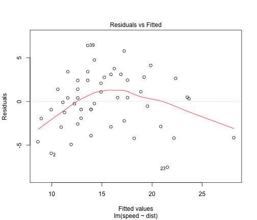
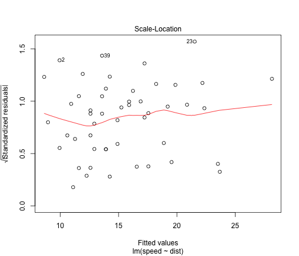
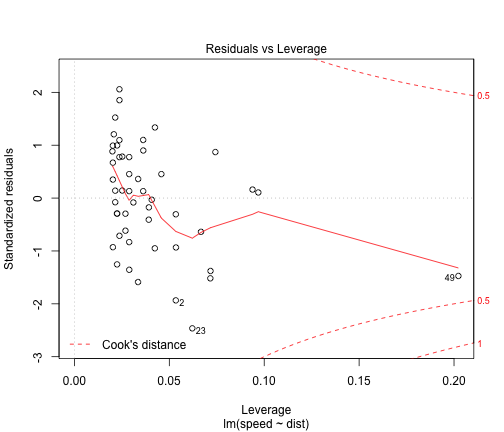

Title
========================================================

This is an R Markdown document. Markdown is a simple formatting syntax for authoring web pages (click the **Help** toolbar button for more details on using R Markdown).

When you click the **Knit HTML** button a web page will be generated that includes both content as well as the output of any embedded R code chunks within the document. You can embed an R code chunk like this:


```r
summary(cars)
```

```
##      speed           dist    
##  Min.   : 4.0   Min.   :  2  
##  1st Qu.:12.0   1st Qu.: 26  
##  Median :15.0   Median : 36  
##  Mean   :15.4   Mean   : 43  
##  3rd Qu.:19.0   3rd Qu.: 56  
##  Max.   :25.0   Max.   :120
```

```r

lm1 <- lm(speed ~ dist, data = cars)
anova(lm1)
```

```
## Analysis of Variance Table
## 
## Response: speed
##           Df Sum Sq Mean Sq F value  Pr(>F)    
## dist       1    892     892    89.6 1.5e-12 ***
## Residuals 48    478      10                    
## ---
## Signif. codes:  0 '***' 0.001 '**' 0.01 '*' 0.05 '.' 0.1 ' ' 1
```


You can also embed plots, for example:


```r
plot(cars)
```

 

```r
plot(lm1)
```

    


